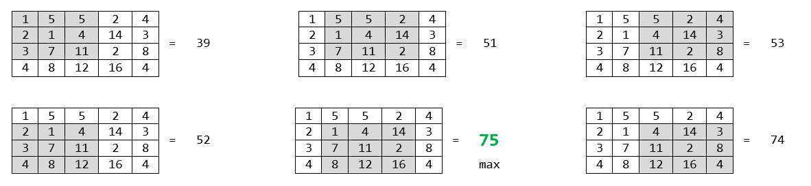
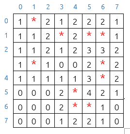

# Ejercicio Práctico
**Unidad 3: cadenas, expresiones regulares y arrays**

Para resolver esta práctica está permitido:
- Consultar la documentación publicada en el curso del Módulo de Programación de Aulas Virtuales.
- Consultar la documentación del API de Java.

No está permitido:
- Consultar cualquier otra documentación.
- Consultar ejercicios resueltos.
- Consultar código fuente publicado en Internet o en cualquier otro soporte, independientemente del lenguaje de programación usado.
- Utilizar inteligencia artificial durante la realización de la práctica.

Haz un fork de este repositorio desde tu cuenta de GitHub, clónalo desde Eclipse e importa el proyecto Maven que contiene.

En el paquete `fp.dam.java.unidad3` de la carpeta `src/main/java` se encuentra la clase `Main` con los métodos estáticos `m1`, `m2`, `m3a` y `m3b`. El objetivo de esta práctica es completar el método `m1`, el método `m2` y el método `m3a` o el método `m3b`.

Para probar las soluciones ejecuta los tests unitarios de JUnit que se encuentra en la clase `TestPractica` del paquete `fp.dam.java.unidad3` que está dentro de la carpeta `src/test/java`. Para ejecutar los tests, pulsa con el botón derecho en esta clase y selecciona la opción  "Run As -> JUnitTest".

Completa cada método según las especificaciones siguientes:

### Método `m1`
Acepta una cadena para extraer de ella todas las subcadenas formadas por dos o más caracteres repetidos, almacenarlas en un `ArrayList` y retornarlo.

Completa este método sin usar expresiones regulares.

### Método `m2`
Hace lo mismo que el anterior, pero extrayendo las cadenas con la ayuda de la siguiente expresión regular: `(.)\1+`

### Método `m3a`
Acepta una matriz y retorna el valor máximo de los resultados que se obtienen sumando los elementos de cada matriz interna de 3x3.

La matriz no puede tener un número de filas o un número de columnas inferior a 3. En caso contrario retorna `null`.

Ejemplo:
      

      
En este ejemplo el método retorna el valor 75.

### Método `m3b`
Crea y retorna el tablero de juego del buscaminas según las especificaciones siguientes:

- Acepta un número entero indicando el tipo de tablero:

    + Si recibe un 1, crea un tablero de 8x8 con 10 minas.
    + Si recibe un 2, crea un tablero de 16x16 con 40 minas.
    + Si recibe un 3, crea un tablero de 16x30 con 99 minas.
    + Si recibe cualquier otro valor retorna inmediatamente algo que se pueda interpretar como una condición de error.
       
- El tablero estará representado por una matriz de números enteros en la que cada posición `[i][j]` representa la casilla situada en la fila i, columna j del tablero.
       
- La minas se colocan de forma aleatoria.

- Para representar una mina en la fila i, columna j del tablero, se almacena el valor `-1` en la posición `[i][j]` de la matriz.

- Cada posición `[i][j]` de la matriz que no represente una mina debe contener el número de minas que rodean a esa casilla.
    
Ejemplo de tablero de 8x8:

